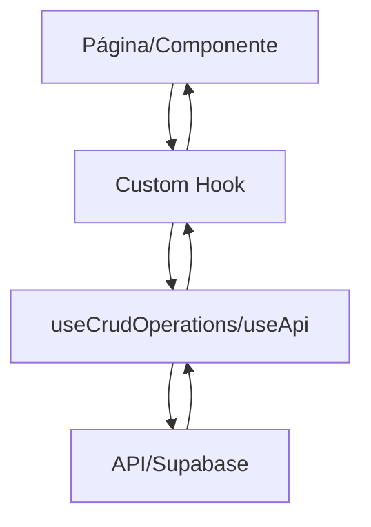

# 🏗️ Arquitectura del Proyecto Laralis

## 📁 Estructura del Proyecto

```
web/
├── app/                      # Páginas de Next.js (App Router)
│   ├── (dashboard)/         # Grupo de rutas del dashboard
│   │   └── expenses/        # Página de gastos
│   ├── assets/              # Gestión de activos
│   ├── patients/            # Gestión de pacientes
│   ├── services/            # Gestión de servicios
│   ├── treatments/          # Gestión de tratamientos
│   ├── reports/             # Reportes y análisis
│   └── settings/            # Configuraciones
│
├── components/              # Componentes React
│   ├── layouts/            # Layouts de la aplicación
│   │   ├── AppLayout.tsx   # Layout principal (refactorizado)
│   │   ├── Sidebar.tsx     # Barra lateral
│   │   ├── UserMenu.tsx    # Menú de usuario
│   │   └── MobileHeader.tsx # Header móvil
│   │
│   └── ui/                 # Componentes UI reutilizables
│       ├── form-modal.tsx  # Modal responsive (mobile-first)
│       ├── DataTable.tsx   # Tabla de datos genérica
│       ├── PageHeader.tsx  # Header de página
│       ├── ConfirmDialog.tsx # Diálogo de confirmación
│       ├── ActionDropdown.tsx # Menú de acciones
│       └── form-field.tsx  # Campos de formulario
│
├── hooks/                   # Custom React Hooks
│   ├── use-crud-operations.ts # CRUD genérico (base)
│   ├── use-api.ts          # Llamadas API genéricas
│   ├── use-services.ts     # Lógica de servicios
│   ├── use-treatments.ts   # Lógica de tratamientos
│   ├── use-patients.ts     # Lógica de pacientes
│   └── use-reports.ts      # Lógica de reportes
│
├── lib/                     # Utilidades y lógica de negocio
│   ├── calc/               # Motor de cálculos
│   ├── repositories/       # Capa de datos (en migración)
│   ├── money.ts           # Manejo de dinero (centavos)
│   └── supabase.ts        # Cliente de Supabase
│
└── messages/               # Internacionalización
    ├── en.json            # Traducciones en inglés
    └── es.json            # Traducciones en español
```

## 🎯 Principios de Arquitectura

### 1. **SOLID Principles**
- **S**ingle Responsibility: Cada componente/hook tiene una sola responsabilidad
- **O**pen/Closed: Extensible sin modificar código existente
- **L**iskov Substitution: Interfaces consistentes
- **I**nterface Segregation: Hooks específicos por dominio
- **D**ependency Inversion: Dependencias inyectadas vía props/context

### 2. **DRY (Don't Repeat Yourself)**
- Componentes reutilizables en `/components/ui`
- Hooks genéricos para operaciones comunes
- Lógica centralizada en hooks específicos

### 3. **Separation of Concerns**
- UI (componentes) separada de lógica (hooks)
- Datos (repositories) separados de presentación
- Cálculos aislados en `/lib/calc`

## 🔄 Flujo de Datos



## 🧩 Componentes Reutilizables

### FormModal
```typescript
// Mobile-first modal que se desliza desde abajo en móvil
<FormModal
  open={open}
  onOpenChange={setOpen}
  title="Título"
  onSubmit={handleSubmit}
>
  {/* Contenido del formulario */}
</FormModal>
```

### DataTable
```typescript
// Tabla genérica con búsqueda y estados vacíos
<DataTable
  columns={columns}
  data={data}
  loading={loading}
  searchPlaceholder="Buscar..."
  emptyState={{
    icon: Icon,
    title: "Sin datos",
    description: "No hay registros"
  }}
/>
```

### PageHeader
```typescript
// Header consistente para todas las páginas
<PageHeader
  title="Título de la página"
  subtitle="Descripción"
  action={<Button>Acción</Button>}
/>
```

## 🪝 Hooks Principales

### useCrudOperations
Hook genérico para operaciones CRUD:
```typescript
const crud = useCrudOperations({
  endpoint: '/api/resources',
  entityName: 'Resource',
  includeClinicId: true
})

// Proporciona:
// - items, loading, error
// - handleCreate, handleUpdate, handleDelete
// - openDialog, closeDialog
// - searchTerm, setSearchTerm
```

### useApi
Hook para llamadas API simples:
```typescript
const api = useApi('/api/endpoint')

// Métodos disponibles:
// - get(), post(data), put(data), patch(data), delete()
// - loading, error, data states
```

### Hooks Específicos del Dominio
Construidos sobre los hooks genéricos:
- `useServices` - Gestión de servicios + supplies
- `useTreatments` - Tratamientos con snapshot de costos
- `usePatients` - Pacientes + sources + campaigns
- `useReports` - Análisis y métricas

## 📊 Estado de Refactorización

### ✅ Completado
1. **AppLayout** - Dividido en 4 componentes modulares
2. **FormModal** - Componente modal responsive
3. **DataTable** - Tabla reutilizable
4. **Hooks principales** - Refactorizados sin duplicación:
   - useServices
   - useTreatments
   - usePatients
   - useReports
   - useFixedCosts

### 🚧 En Progreso
1. **Eliminación de fetch() directos**
   - 15+ archivos aún usan fetch directo
   - Repositories necesitan migración

2. **Páginas grandes por refactorizar**
   - services/page.tsx (525 líneas)
   - expenses/page.tsx (496 líneas)
   - patients/page.tsx (486 líneas)

### 📝 Pendiente
1. Migrar todos los repositories a hooks
2. Refactorizar componentes de expenses
3. Implementar SimpleCrudPage para páginas simples
4. Eliminar duplicación en hooks restantes

## 🎨 Patrones de UI

### Mobile-First
- FormModal se desliza desde abajo en móvil
- Responsive breakpoints: sm (640px), md (768px), lg (1024px)
- Touch targets mínimo 44px

### Diseño Apple-like
- Bordes redondeados (radius-16)
- Sombras suaves
- Espaciado generoso
- Colores suaves en modo oscuro

### Accesibilidad
- ARIA labels en todos los controles
- Focus visible
- Contraste AA mínimo
- Soporte para lectores de pantalla

## 💰 Manejo de Dinero

**IMPORTANTE**: Todo el dinero se maneja en centavos (integers)

```typescript
// ✅ Correcto
const price = 15000 // $150.00

// ❌ Incorrecto
const price = 150.00 // Nunca usar floats

// Formateo con helper
import { formatCurrency } from '@/lib/money'
formatCurrency(15000) // "$150.00"
```

## 🌐 Internacionalización

Todas las strings visibles vienen de archivos de traducción:

```typescript
const t = useTranslations()
<Button>{t('common.save')}</Button>
```

Archivos:
- `/messages/en.json` - Inglés
- `/messages/es.json` - Español

## 🔒 Seguridad

1. **Autenticación**: Supabase Auth
2. **RLS**: Row Level Security en todas las tablas
3. **Multi-tenancy**: Aislamiento por clinic_id
4. **Validación**: Zod en formularios
5. **Sanitización**: Inputs sanitizados automáticamente

## 🚀 Performance

### Optimizaciones Implementadas
- Lazy loading de componentes pesados
- Memoización con useMemo/useCallback
- Suspense + Skeleton loaders
- Bundle splitting automático

### Métricas Objetivo
- Bundle < 170KB gzipped
- FCP < 1.5s
- TTI < 3.5s
- CLS < 0.1

## 🧪 Testing

### Estructura de Tests
```
__tests__/
├── unit/       # Tests unitarios (lib/calc)
├── hooks/      # Tests de hooks
└── e2e/        # Tests end-to-end (Cypress)
```

### Comandos
```bash
npm test        # Tests unitarios
npm run test:e2e # Tests E2E
npm run lint    # Linting
npm run typecheck # Type checking
```

## 📝 Convenciones de Código

### Nomenclatura
- Componentes: PascalCase
- Hooks: camelCase con prefijo 'use'
- Archivos: kebab-case
- Constantes: UPPER_SNAKE_CASE

### Estructura de Componentes
```typescript
// 1. Imports
// 2. Types/Interfaces
// 3. Component
// 4. Styled components (si aplica)
// 5. Helper functions
```

### Git Commits
Conventional Commits:
- `feat:` Nueva funcionalidad
- `fix:` Corrección de bugs
- `refactor:` Refactorización
- `docs:` Documentación
- `test:` Tests

## 🔧 Herramientas

- **Framework**: Next.js 14 (App Router)
- **UI**: Tailwind CSS + shadcn/ui
- **Estado**: React Hooks + Context
- **Forms**: React Hook Form + Zod
- **Base de datos**: Supabase
- **Internacionalización**: next-intl
- **Testing**: Vitest + Cypress

## 📚 Referencias

- [Next.js Docs](https://nextjs.org/docs)
- [Supabase Docs](https://supabase.com/docs)
- [shadcn/ui](https://ui.shadcn.com)
- [React Hook Form](https://react-hook-form.com)

---

*Última actualización: Agosto 2025*
*Autor: Claude + Ismael*